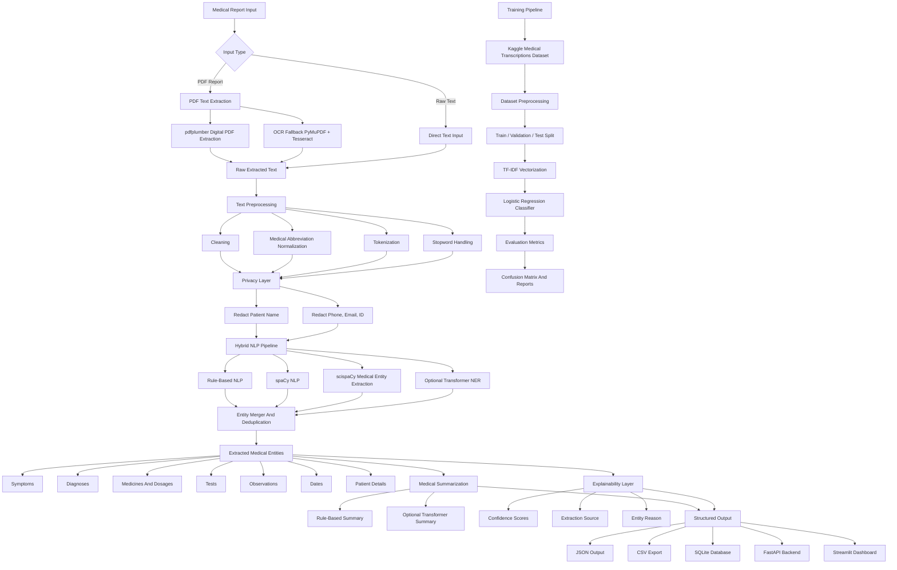
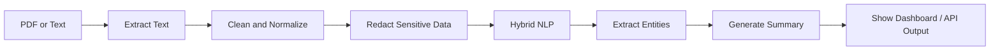

# Workflow Architecture Diagram

This diagram shows the complete architecture of the Medical Report Analyzer system.

## High-Level Architecture



## Simple Workflow View



## Architecture Explanation

The system has two main pipelines.

## 1. Report Analysis Pipeline

This pipeline is used when a user uploads or enters a medical report.

Steps:

1. The user provides a PDF or raw medical text.
2. PDF text is extracted using `pdfplumber`.
3. If the PDF is scanned, OCR fallback can be used with PyMuPDF and Tesseract.
4. The extracted text is cleaned and normalized.
5. Medical abbreviations such as `BP`, `SOB`, `Dx`, and `Rx` are expanded.
6. Sensitive patient information is redacted.
7. The hybrid NLP pipeline extracts medical entities.
8. Duplicate entities are merged.
9. A medical summary is generated.
10. The final output is displayed in Streamlit, returned through FastAPI, saved to SQLite, or exported as JSON/CSV.

## 2. Training And Evaluation Pipeline

This pipeline is used to train the medical specialty classifier.

Steps:

1. The Kaggle Medical Transcriptions dataset is loaded.
2. Important text columns are combined.
3. Text is cleaned and normalized.
4. The dataset is split into train, validation, and test sets.
5. TF-IDF converts text into numeric features.
6. Logistic Regression is trained for classification.
7. Accuracy, precision, recall, F1-score, and confusion matrix are generated.

## Components

| Component | Purpose |
|---|---|
| Streamlit Dashboard | User interface for uploading and analyzing reports |
| FastAPI Backend | API service for report analysis |
| PDF Extractor | Extracts text from digital or scanned PDFs |
| Preprocessor | Cleans text, expands abbreviations, and redacts private data |
| Hybrid NLP Pipeline | Combines rules, spaCy, scispaCy, and optional transformer NER |
| Entity Extractor | Extracts symptoms, diagnoses, medicines, tests, observations, and dates |
| Summarizer | Creates a short medical summary |
| SQLite Store | Saves structured report output |
| Training Pipeline | Trains and evaluates the medical specialty classifier |

## Output Flow

The final output is available in multiple forms:

```text
Readable Summary
Extracted Entities
Confidence Scores
Explainability Details
Structured JSON
CSV Export
SQLite Record
API Response
Dashboard View
```

## Summary

The architecture is modular and scalable. Each part of the system has a separate responsibility:

- extraction handles PDFs
- preprocessing prepares text
- NLP extracts medical knowledge
- summarization creates readable output
- storage saves structured results
- API and dashboard expose the system to users
- training pipeline improves classification performance
